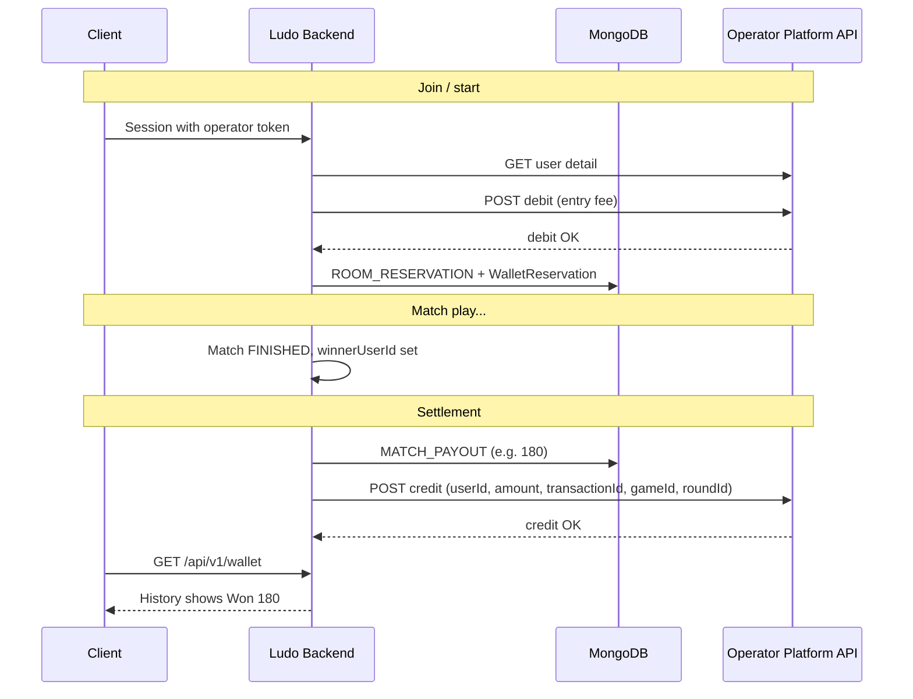

# Winner Wallet Credit Flow (Generic Platform Integration)

This document explains what happens **after a real player wins** a Ludo match: how the win amount is calculated, written to the Ludo ledger, shown in the client History page, and credited to the **external operator/platform wallet**.

It is written for **any platform**, not one specific operator. Point the env vars at that platform’s APIs.

Line numbers refer to the codebase as of this document and may shift slightly after refactors; search the symbol names if a line moves.

---

## High-level flow

```text
Match finishes (winner set)
        │
        ▼
Room settlement
  OnlineMatchmakingService.settleAndMarkRoomFinished
  / GameplayModule.settleAndMarkRoomFinished
        │
        ▼
WalletService.payoutWinner
        │
        ├─1─ Calculate pot − platform fee = winner payout
        │
        ├─2─ Commit Ludo Mongo ledger (MATCH_PAYOUT)  ← History "Won 180"
        │
        └─3─ HTTP credit to operator wallet API
              (only if entry fee was debited on that platform)
        │
        ▼
Operator / host platform increases user balance
```

There are **two wallets**:

| Wallet | Purpose |
|--------|---------|
| **Ludo internal ledger** (Mongo) | History UI, local balances, idempotent settlement |
| **Operator platform wallet** | Real money / coins on the host site |

Winning updates the Ludo ledger always (when payout &gt; 0 and winner is not house/bot). External credit runs only when the join debit succeeded on the operator API.

---

## End-to-end steps

### 0. Player enters via a platform (prerequisite)

Launch URL typically includes operator token and game id:

```text
https://your-ludo-frontend/?id=<OPERATOR_SESSION_TOKEN>&game_id=<GAME_ID>
```

| Step | File | Symbol / lines (approx.) |
|------|------|---------------------------|
| Create operator session | `server/.../identity/IdentityModule.kt` | `createOperatorSessionFromToken` ~149–187 |
| Fetch user + balance from platform | `server/.../operator/OperatorGatewayModule.kt` | `fetchUserDetail` |
| Store `operatorToken`, `operatorUserId`, `operatorId`, `operatorGameId` on session | `IdentityModule.kt` | session save ~164–175 |

**Env used here**

| Env | Role |
|-----|------|
| `APP_OPERATOR_BASE_URL` | Platform API host |
| `APP_OPERATOR_USER_DETAIL_PATH` | Path to load user/balance |
| `APP_OPERATOR_GAME_ID` | Fallback game id if query omits `game_id` |
| Client: `NEXT_PUBLIC_OPERATOR_PLATFORM_ENABLED=true` | Frontend treats launch as operator mode |
| Client: `NEXT_PUBLIC_API_BASE_URL` | Ludo backend base URL |

Without a valid operator session, later debit/credit cannot run (guest/local wallet only).

---

### 1. Entry fee debit (before the match)

When the room starts, each **real** seat reserves/debits the entry fee.

| Step | File | Symbol / lines (approx.) |
|------|------|---------------------------|
| Reserve seats | `OnlineMatchmakingService.kt` | `reserveEntryFeesForSeats` ~911+ |
| Debit operator or local reserve | `WalletModule.kt` | `reserveEntryFee` ~480–538 |
| HTTP debit | `OperatorGatewayModule.kt` | `debit` ~195–301 |

On successful operator debit, the room stores a `WalletReservation` with:

- `externalDebitTransactionId`
- `externalDebitConfirmed = true`
- `operatorToken`, `operatorUserId`, `operatorId`, `gameId`

```524:536:server/src/main/kotlin/com/craft/ludo/wallet/WalletModule.kt
                        ).thenReturn(
                            WalletReservation(
                                userId = userId,
                                transactionId = transactionId,
                                amount = amount,
                                externalDebitTransactionId = debitTransactionId,
                                externalDebitConfirmed = true,
                                operatorToken = operatorSession.operatorToken,
                                operatorUserId = operatorSession.operatorUserId,
                                operatorId = operatorSession.operatorId,
                                // ...
                            ),
                        )
```

**Env used**

| Env | Role |
|-----|------|
| `APP_OPERATOR_BASE_URL` | Debit host |
| `APP_OPERATOR_BALANCE_PATH` | Debit path (e.g. `/service/operator/user/balance/v2`) |
| `APP_OPERATOR_GAME_ID` | Fallback `game_id` on debit body |
| `APP_GAMEPLAY_ONLINE_ENTRY_FEE` | Fee amount (e.g. `100`) |

Debit request shape (current integration):

```http
POST {APP_OPERATOR_BASE_URL}{APP_OPERATOR_BALANCE_PATH}
Header: token: <operator session token>
Body: txn_id, amount, description, txn_type, ip, game_id, user_id, operator_id
```

---

### 2. Match ends — settlement triggered

When the match is `FINISHED` with a `winnerUserId`, the room is settled once.

| Path | File | Symbol / lines (approx.) |
|------|------|---------------------------|
| Online rooms | `OnlineMatchmakingService.kt` | `settleAndMarkRoomFinished` ~812–852 |
| Private / other finish paths | `GameplayModule.kt` | `settleAndMarkRoomFinished` ~2658+, `payoutWinner` call ~2143+ |

```812:824:server/src/main/kotlin/com/craft/ludo/gameplay/OnlineMatchmakingService.kt
    private fun settleAndMarkRoomFinished(room: RoomDocument, match: MatchDocument): Mono<RoomDocument> {
        // ...
        val settlement = match.winnerUserId
            ?.let { winnerUserId ->
                walletService.payoutWinner(
                    matchId = match.id,
                    winnerUserId = winnerUserId,
                    reservations = room.walletReservations,
                    roomId = room.id,
                )
            }
```

---

### 3. Calculate winner amount

| File | Symbol / lines (approx.) |
|------|---------------------------|
| `WalletModule.kt` | `payoutWinner` ~672–679 |
| `WalletModule.kt` | `payoutWinnerWithFee` ~689+ |
| `WalletModule.kt` | `calculateWinnerLedgerPayoutAmount` ~157+ |
| `WalletModule.kt` | `calculateFlatPlatformFeeAmount` ~183+ |

Formula:

```text
potAmount     = sum of reservation amounts (real + bot seats as configured)
rakeAmount    = platformFeePerPlayer × number of paid seats
winnerPayout  = potAmount − rakeAmount   (if real winner)
```

Example (2 players, fee 100, platform fee 10/seat):

| Item | Value |
|------|-------|
| Pot | 200 |
| Rake | 20 |
| **Winner payout** | **180** |

**Env / settings**

| Source | Role |
|--------|------|
| `APP_GAMEPLAY_ONLINE_ENTRY_FEE` | Entry fee |
| `APP_WALLET_PLATFORM_FEE_PER_PLAYER` (or admin platform settings) | Per-seat fee (default `10`) |
| `APP_WALLET_HOUSE_USER_ID` | House id when bot/house wins |

**No external credit when:**

- Winner is a **bot** / synthetic → pot treated as house win  
- Winner is **house**  
- Calculated payout ≤ 0  
- Winner used operator wallet but **debit was never confirmed** → ledger payout may be `0`

---

### 4. Write Ludo History (`MATCH_PAYOUT`)

Inside the Mongo transaction:

| File | Symbol / lines (approx.) |
|------|---------------------------|
| `WalletModule.kt` | `persistWinnerPayout` ~920–939 |
| Type enum | `WalletTransactionType.MATCH_PAYOUT` ~46 |

Then client maps it:

| File | Symbol / lines (approx.) |
|------|---------------------------|
| `client/app/lib/server-game.js` | `WALLET_HISTORY_OUTCOMES.MATCH_PAYOUT = "Won"` ~28 |
| `client/app/lib/server-game.js` | `normalizeWalletResponse` / history filter ~406–421 |
| UI | `client/app/components/ludo-shell.js` History drawer |

So **“Won 180”** on the client comes from the Ludo wallet API transaction amount, not from a hardcoded UI constant.

Operator credit is called **after** this ledger commit succeeds (`payoutWinnerWithFee` ~768–796), so History can still show the win even if the external credit API fails (failure is logged for replay).

---

### 5. Credit money on the operator platform

| File | Symbol / lines (approx.) |
|------|---------------------------|
| Gate + build message | `WalletModule.kt` `enqueueWinnerExternalCreditIfNeeded` ~1013–1036 |
| Required reservation fields | `WalletModule.kt` `enqueueExternalCreditIfNeeded` ~1039–1066 |
| HTTP POST | `OperatorGatewayModule.kt` `enqueueCredit` ~304–450 |
| URL resolution | `OperatorGatewayModule.kt` `resolveCreditUrl` ~142–153 |

**Required before credit is sent** (all must be present on the winner’s reservation):

1. `externalDebitTransactionId`  
2. `externalDebitConfirmed == true`  
3. `operatorToken`  
4. `operatorUserId`  
5. `operatorId`  

If any are missing → **no HTTP credit** (function returns empty).

**HTTP call**

```http
POST {resolved credit URL}
Content-Type: application/json
token: <operatorToken>   # sent when non-blank

{
  "userId": "<operatorUserId>",
  "amount": 180.00,
  "transactionId": "<new unique txn id>",
  "gameId": "<game id as string>",
  "roundId": "<matchId>"
}
```

**How the URL is chosen**

| Env | Behavior |
|-----|----------|
| `APP_OPERATOR_CREDIT_URL` | If non-empty → **this full URL is used** (path ignored) |
| `APP_OPERATOR_CREDIT_PATH` | Used only if credit URL is empty: `{BASE_URL}{PATH}` or full URL if path itself is `http(s)` |
| `APP_OPERATOR_BASE_URL` | Used when building from path only |
| `APP_OPERATOR_GAME_ID` | Fallback `gameId` in body |

Example:

```env
APP_OPERATOR_CREDIT_URL=https://platform.example.com/api/wallet/credit
APP_OPERATOR_CREDIT_PATH=/api/wallet/credit
```

→ Actual request: `POST https://platform.example.com/api/wallet/credit`  
(`CREDIT_PATH` is ignored because `CREDIT_URL` is set.)

Config binding:

| File | Lines (approx.) |
|------|-----------------|
| `server/src/main/resources/application.yml` | `app.operator.*` ~99–109 |
| `server/.../shared/config/AppProperties.kt` | `OperatorProperties` ~70–82 |

---

## Sequence diagram



---

## Env checklist (generic platform)

### Required for operator debit + credit

```env
# Platform API host (login / detail / debit)
APP_OPERATOR_BASE_URL=https://platform.example.com

APP_OPERATOR_LOGIN_PATH=/operator/user/login
APP_OPERATOR_USER_DETAIL_PATH=/service/user/detail
APP_OPERATOR_BALANCE_PATH=/service/operator/user/balance/v2

# Winner / refund credit (prefer full URL)
APP_OPERATOR_CREDIT_URL=https://platform.example.com/api/wallet/credit
APP_OPERATOR_CREDIT_PATH=/api/wallet/credit

APP_OPERATOR_GAME_ID=2
```

### Game economy

```env
APP_GAMEPLAY_ONLINE_ENTRY_FEE=100
APP_WALLET_PLATFORM_FEE_PER_PLAYER=10
APP_WALLET_HOUSE_USER_ID=house
APP_WALLET_CURRENCY=INR
```

### Frontend

```env
NEXT_PUBLIC_API_BASE_URL=https://api.your-ludo.com
NEXT_PUBLIC_OPERATOR_PLATFORM_ENABLED=true
```

### Legacy (optional)

RabbitMQ credit (`AMQP_URI`, `APP_OPERATOR_CREDIT_EXCHANGE`, queue/routing key) is **legacy**. Current winner credit uses **HTTP** via `APP_OPERATOR_CREDIT_URL`. You can leave AMQP unset if you only use HTTP credit.

---

## What your platform must implement

To embed this Ludo game on **any** host platform, that platform (or its gateway) must provide:

### 1. Session / user detail

- Accept the launch `id` (token) Ludo sends.  
- Return user id, display name, balance, currency, operator id.  
- Ludo calls this via `APP_OPERATOR_USER_DETAIL_PATH` (relative to `APP_OPERATOR_BASE_URL`).

### 2. Debit (entry fee)

- `POST` balance/debit endpoint.  
- Idempotent on `txn_id`.  
- Ludo stores the debit txn id and later may reference it.

### 3. Credit (win / refund)

- `POST` to the URL in `APP_OPERATOR_CREDIT_URL`.  
- Accept JSON:

```json
{
  "userId": "string",
  "amount": 180.00,
  "transactionId": "string",
  "gameId": "2",
  "roundId": "match_..."
}
```

- Optional header: `token`.  
- Prefer JSON response with `status: true` (or `success: true`); otherwise Ludo may treat non-boolean bodies as success if HTTP 2xx.

### 4. Launch contract

```text
https://<ludo-frontend>/?id=<token>&game_id=<id>
```

Enable `NEXT_PUBLIC_OPERATOR_PLATFORM_ENABLED=true` on the Ludo frontend.

### 5. CORS / origins

Add the Ludo frontend origin to `APP_WEB_ALLOWED_ORIGIN_PATTERNS` on the Ludo server.

---

## File map (quick reference)

| Concern | Primary file |
|---------|----------------|
| Operator session | `server/src/main/kotlin/com/craft/ludo/identity/IdentityModule.kt` |
| Debit + credit HTTP client | `server/src/main/kotlin/com/craft/ludo/operator/OperatorGatewayModule.kt` |
| Fees, ledger, payout, credit trigger | `server/src/main/kotlin/com/craft/ludo/wallet/WalletModule.kt` |
| Online settle after win | `server/src/main/kotlin/com/craft/ludo/gameplay/OnlineMatchmakingService.kt` |
| Other settle paths | `server/src/main/kotlin/com/craft/ludo/gameplay/GameplayModule.kt` |
| Env binding | `server/src/main/resources/application.yml`, `AppProperties.kt` |
| History “Won” UI mapping | `client/app/lib/server-game.js` |
| History drawer UI | `client/app/components/ludo-shell.js` |

---

## Failure modes (ops)

| Symptom | Likely cause |
|---------|----------------|
| History shows Won, platform balance unchanged | Credit HTTP failed after ledger commit — search logs for `Operator wallet credit api failed` / `Operator winner credit publish failed` |
| No Won row at all | Bot/house win, payout 0, or settlement error — search `Ludo winner payout failed` |
| No credit attempted | Debit never confirmed / missing operator fields on reservation |
| Wrong credit host | `APP_OPERATOR_CREDIT_URL` wrong or still a placeholder |

---

## Summary

1. Win → settle room → `payoutWinner`.  
2. Amount = pot − platform fee (e.g. 200 − 20 = **180**).  
3. Ludo Mongo `MATCH_PAYOUT` → client History **Won**.  
4. Then `POST APP_OPERATOR_CREDIT_URL` with `userId`, `amount`, `transactionId`, `gameId`, `roundId`.  
5. Any new platform only needs compatible **user detail**, **debit**, and **credit** APIs + correct env URLs — no Aakda-specific hard dependency beyond default example URLs in config.
